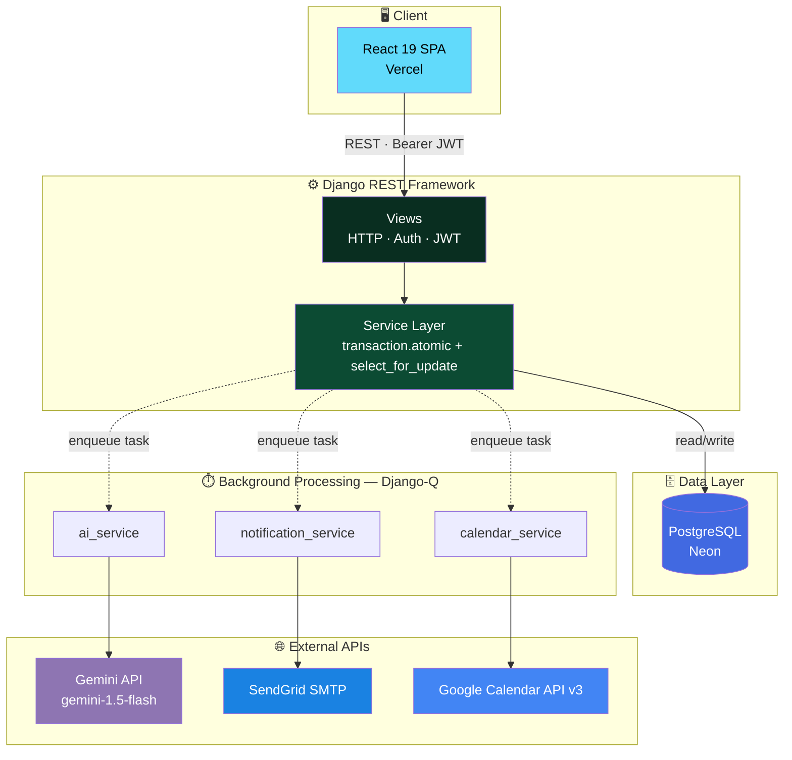

<div align="center">

# 🩺 AyuSetu

### *Bridge of Health*

**An AI-powered clinical appointment & follow-up platform**
*Concurrency-safe booking · Gemini-powered symptom triage · Automated patient follow-up*


[Features](#-features) · [Architecture](#-architecture) · [Tech Stack](#-tech-stack) · [Getting Started](#-local-setup) · [API Docs](docs/api-documentation.md) · [System Design](docs/system-design.md)

</div>

---

## 🎯 Problem Statement

Scheduling clinic appointments in India is still largely phone-based — leading to double-bookings, missed follow-ups, and doctors walking into consultations with no structured information about the patient.

**AyuSetu** solves this end-to-end: patients self-book slots and submit symptoms before their visit, doctors get an AI-generated triage summary and a structured consultation workflow, and clinic admins get full oversight of schedules, leaves, and appointment activity — all backed by concurrency-safe booking and automated email notifications.

---

## ✅ Features

### 🧑‍⚕️ Patient Portal
- Browse doctors by specialisation and view available slots per date
- Book an appointment with a **5-minute slot hold** that prevents concurrent double-booking
- Submit pre-visit symptoms and receive an **AI triage summary** (urgency, chief complaint, suggested questions)
- View upcoming and past appointments in full detail
- Reschedule or cancel appointments
- View AI-generated post-visit instructions derived from the doctor's notes
- Get email notifications for booking, cancellation, and rescheduling

### 👨‍⚕️ Doctor Portal
- View today's schedule with patient chief complaints and AI-suggested questions
- Write consultation notes and add multi-medication prescriptions
- Finalize a consultation to trigger an AI post-visit summary and patient email
- View complete appointment history

### 🛠️ Admin Portal
- Register and manage doctor profiles (specialisation, slot duration)
- Configure doctor working hours, including split shifts
- Schedule doctor leaves — auto-cancels conflicting appointments and notifies affected patients
- Global appointment ledger with search, status/date/doctor filters, and row-level detail view

### ⚙️ Cross-Cutting
| Capability | Implementation |
| :--- | :--- |
| **Double-booking prevention** | `select_for_update()` row lock + partial unique index → `HTTP 409` on conflict |
| **Slot hold lease** | 5-minute `HELD` state with periodic cleanup of expired holds |
| **Email delivery** | Retry logic (3 attempts, 2-minute backoff), `PENDING → PROCESSING → SENT / FAILED` state machine |
| **Calendar sync** | Google Calendar OAuth 2.0 → event created on booking confirmation |
| **Theming** | Persistent light/dark toggle with full contrast support across all portals |
| **Test coverage** | 31 automated tests across accounts, doctors, appointments, consultations, notifications, and calendar integration |

---

## 🏗️ Architecture

AyuSetu follows a strict **Views → Service Layer → External APIs** separation. Views handle HTTP and auth only; all business logic lives in service modules; every external call (Gemini, SendGrid, Google Calendar) runs asynchronously via Django-Q, never inside the request/response cycle.



**Why this matters:** no external API call — AI triage, email, or calendar sync — ever blocks a request. A booking confirms instantly; the Gemini summary, confirmation email, and calendar event are all queued and processed in the background, with retries on failure.

Full diagrams and layer-by-layer walkthroughs: [`docs/architecture.md`](docs/architecture.md) · [`docs/system-design.md`](docs/system-design.md)

---

## 🛠️ Tech Stack

| Layer | Technologies |
| :--- | :--- |
| **Frontend** | React 19, Vite 8, Tailwind CSS v4, React Router v7, Axios, Lucide Icons, React Hook Form |
| **Backend** | Python 3.10+, Django 6.1, Django REST Framework, SimpleJWT |
| **Database** | PostgreSQL (production, via Neon) / SQLite (local dev) |
| **Background Jobs** | django-q2 (ORM broker; synchronous fallback on Windows) |
| **AI** | Google Gemini API — `gemini-1.5-flash` (free tier) via `google-generativeai` |
| **Email** | SendGrid SMTP (production) / Django console backend (dev) |
| **Calendar** | Google Calendar API v3 — `google-api-python-client`, `google-auth-oauthlib` |
| **Hosting** | Vercel (frontend) · Render (backend) · Neon (PostgreSQL) · Upstash (Redis, optional) |

---

## 📁 Project Structure

```
ayusetu-healthcare/
├── backend/
│   ├── accounts/              # User model, auth (register/login/JWT)
│   ├── doctors/               # Doctor profiles, working hours, leaves
│   ├── appointments/          # Booking: hold → confirm → complete/cancel
│   ├── consultations/         # Notes, prescriptions, AI summaries
│   ├── notifications/         # Email queue with retry state machine
│   ├── ai/                    # Gemini wrapper (pre-visit + post-visit)
│   ├── calendar_integration/  # Google Calendar OAuth + event sync
│   ├── config/                # Django settings, URL config, WSGI
│   ├── requirements.txt
│   └── .env.example           # All environment variables, documented
├── frontend/
│   ├── src/
│   │   ├── pages/             # patient/, doctor/, admin/, auth/
│   │   ├── components/        # Layout, ProtectedRoute, shared UI
│   │   ├── context/           # AuthContext, ThemeContext
│   │   └── services/          # Axios API client
│   ├── package.json
│   └── vite.config.js
├── docs/                      # Full documentation set (see below)
├── README.md
└── .gitignore
```

---

## 🌐 Live Demo

| Service | URL |
| :--- | :--- |
| **Frontend** (Vercel) | *https://ayusetu-healthcare.vercel.app* |
| **Backend API** (Render) | *https://ayusetu-backend.onrender.com* |

> The backend runs on Render's free tier and may take ~30 seconds to cold-start on the first request.
> Login with the [demo credentials](#-demo-credentials) below.

---

## ⚡ Local Setup

### Prerequisites
- **Python 3.10+** — [python.org/downloads](https://www.python.org/downloads/)
- **Node.js 18+** and npm — [nodejs.org](https://nodejs.org/)
- **PostgreSQL** *(optional — SQLite is used automatically if `DATABASE_URL` is unset)*
- **Redis** *(optional — Django-Q falls back to synchronous mode without it)*

### 1. Clone the repository
```bash
git clone https://github.com/vip23anchib/ayusetu-healthcare.git
cd ayusetu-healthcare
```

### 2. Backend setup
```bash
cd backend
python -m venv venv

# Windows (PowerShell)
.\venv\Scripts\Activate.ps1
# macOS / Linux
source venv/bin/activate

pip install -r requirements.txt

cp .env.example .env
# Edit backend/.env — leave DATABASE_URL empty to use SQLite for local dev
# See the Environment Variables table below for details

python manage.py migrate
python manage.py seed_data     # seeds demo doctors, patients, and admin
python manage.py runserver     # → http://127.0.0.1:8000
```

### 3. Frontend setup
In a new terminal:
```bash
cd frontend
npm install
npm run dev                    # → http://localhost:5173
```

### 4. (Optional) Background workers with Redis
By default, Django-Q runs synchronously (`DJANGO_Q_SYNC=True`) — no separate worker needed. For async processing:
```bash
# Install & start Redis, then in backend/.env:
#   REDIS_URL=redis://localhost:6379
#   DJANGO_Q_SYNC=False

cd backend
python manage.py qcluster
```

### 5. Run the test suite
```bash
cd backend
python manage.py test accounts doctors appointments consultations notifications calendar_integration
# → 31 tests should pass
```

---

## 🔧 Environment Variables

Full list with descriptions: [`backend/.env.example`](backend/.env.example)

| Variable | Required | Description |
| :--- | :---: | :--- |
| `SECRET_KEY` | ✅ | Django secret key — generate a unique one for production |
| `DEBUG` | ✅ | `True` for dev, `False` for production |
| `DATABASE_URL` | — | PostgreSQL URL. If blank, SQLite is used (local dev only) |
| `JWT_SECRET_KEY` | ✅ | JWT signing key (can equal `SECRET_KEY`) |
| `GEMINI_API_KEY` | — | Enables AI triage. Free key from [aistudio.google.com](https://aistudio.google.com/app/apikey). Falls back to keyword mock if absent |
| `EMAIL_PROVIDER` | ✅ | `console` (dev — prints to terminal) or `sendgrid` (production) |
| `EMAIL_API_KEY` | — | SendGrid API key. Only needed if `EMAIL_PROVIDER=sendgrid` |
| `EMAIL_FROM` | ✅ | Sender address for outgoing emails |
| `GOOGLE_CLIENT_ID` | — | Google Calendar OAuth. Calendar sync disabled if absent |
| `GOOGLE_CLIENT_SECRET` | — | Google Calendar OAuth |
| `GOOGLE_REDIRECT_URI` | ✅ | OAuth callback URL — must match Google Cloud Console exactly |
| `REDIS_URL` | — | Redis URL for Django-Q. Falls back to synchronous ORM mode if blank |
| `DJANGO_Q_SYNC` | ✅ | `True` = tasks run inline (Windows/CI). `False` = async workers |
| `FRONTEND_URL` | ✅ | Used in email templates for links back to the app |
| `BACKEND_URL` | ✅ | Used in calendar OAuth redirects |

---

## 🔐 Demo Credentials

> ⚠️ These are **fake demo accounts** seeded by `python manage.py seed_data`. All emails and passwords are test-only.

| Role | Name | Email | Password |
| :--- | :--- | :--- | :--- |
| Admin | Clinic Administrator | `admin@ayusetu.com` | `Admin@123` |
| Doctor | Dr. Ananya Reddy *(Cardiology)* | `dr.ananya.reddy@example.com` | `Doctor@123` |
| Doctor | Dr. Vikram Iyer *(General Physician)* | `dr.vikram.iyer@example.com` | `Doctor@123` |
| Doctor | Dr. Meera Krishnan *(Dermatology)* | `dr.meera.krishnan@example.com` | `Doctor@123` |
| Doctor | Dr. Arjun Kapoor *(Orthopedics)* | `dr.arjun.kapoor@example.com` | `Doctor@123` |
| Doctor | Dr. Sana Sheikh *(Pediatrics)* | `dr.sana.sheikh@example.com` | `Doctor@123` |
| Doctor | Dr. Rajesh Nair *(ENT Specialist)* | `dr.rajesh.nair@example.com` | `Doctor@123` |
| Patient | Rohan Malhotra | `rohan.malhotra@example.com` | `Patient@123` |
| Patient | Ananya Reddy | `ananya.reddy@example.com` | `Patient@123` |
| Patient | Aditya Sharma | `aditya.sharma@example.com` | `Patient@123` |
| Patient | Priya Nair | `priya.nair@example.com` | `Patient@123` |
| Patient | Kabir Mehta | `kabir.mehta@example.com` | `Patient@123` |

---

## 🚀 Deployment

| Component | Service | Notes |
| :--- | :--- | :--- |
| **Frontend** | [Vercel](https://vercel.com) | Connect GitHub repo → root directory `frontend` → auto-deploys on push |
| **Backend** | [Render](https://render.com) | Web service → root directory `backend` → build: `pip install -r requirements.txt && python manage.py migrate && python manage.py seed_data` → start: `gunicorn config.wsgi:application --bind 0.0.0.0:$PORT` |
| **Database** | [Neon](https://neon.tech) | Managed PostgreSQL → copy connection string to `DATABASE_URL` |
| **Redis** | [Upstash](https://upstash.com) | Redis for Django-Q async workers → copy URL to `REDIS_URL`, set `DJANGO_Q_SYNC=False` |

**Production checklist:**
- [ ] `DEBUG=False` and a freshly generated `SECRET_KEY`
- [ ] `CORS_ALLOWED_ORIGINS` set to the deployed frontend URL
- [ ] `GOOGLE_REDIRECT_URI` set to the deployed backend callback URL
- [ ] `EMAIL_PROVIDER=sendgrid` with a valid `EMAIL_API_KEY`

Full walkthrough: [`docs/full-guide.md`](docs/full-guide.md)

---

## 📚 Documentation

| Document | Description |
| :--- | :--- |
| [API Documentation](docs/api-documentation.md) | Every endpoint — method, path, request/response shapes, error codes |
| [Database Schema](docs/database-schema.md) | ER diagram, all tables, constraints, and design decisions |
| [System Design](docs/system-design.md) | Double-booking prevention, slot holds, leave conflicts, notification retry |
| [Architecture Overview](docs/architecture.md) | Full system diagram, service layer isolation, layer-by-layer walkthrough |
| [LLM Prompts](docs/llm-prompts.md) | Verbatim Gemini prompts for pre-visit triage and post-visit summary |
| [Google Calendar Setup](docs/google-calendar-setup.md) | Step-by-step OAuth 2.0 credential setup guide |

---

## ⚠️ Known Limitations

Built under a 2-day MVP constraint. The following were intentionally simplified:

1. **No real-time updates** — the frontend polls on page load; no WebSocket/SSE push for live schedule changes.
2. **SQLite limitations** — `select_for_update()` row locking is fully effective only on PostgreSQL. Local SQLite dev relies on the partial unique index as the sole concurrency guard.
3. **Django-Q on Windows** runs synchronously (`DJANGO_Q_SYNC=True`) since Windows doesn't support `os.fork()`. Set `False` in production on Linux.
4. **Google Calendar** requires per-user OAuth and is in "Testing" mode (only pre-added test users can authorize). Public use requires Google app verification.
5. **AI triage is not a diagnosis** — summaries are clearly labeled as clinician-review aids. Uses Gemini's free tier (`gemini-1.5-flash`); falls back to a keyword-based mock if `GEMINI_API_KEY` is absent.
6. **Email in dev** uses the `console` backend — emails print to the terminal instead of reaching real inboxes.
7. **No file uploads** — patient documents, images, and lab reports are out of scope for this MVP.

---

## 📄 License

Built for the AyuSetu Healthcare MVP Assignment.

---

<div align="center">

**Built by Vipanchi Barman**

</div>
