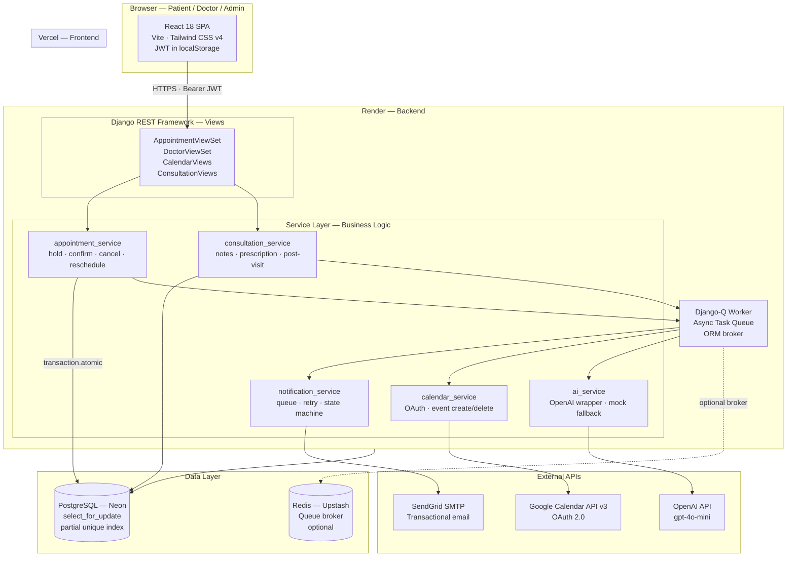

# AyuSetu — Architecture Overview

This document describes the system architecture of AyuSetu, from the React frontend through the Django REST API to PostgreSQL and the three external integrations. It explains why the system is structured the way it is, and why each external service is accessed through an isolated service module rather than directly from views.

---

## System Architecture Diagram

---

## Layer-by-Layer Walkthrough

### 1. React SPA (Vercel)

The frontend is a single-page application built with React 18 and Vite. All three portals (Patient, Doctor, Admin) are served from a single deployment on Vercel. The SPA communicates exclusively via REST API calls to the backend using Axios, attaching a `Bearer <token>` JWT header on every authenticated request.

**Theme state** is persisted in `localStorage` and applied via a `.dark` class on `<html>` — no server round-trip required for theming.

**Routing** is handled client-side by React Router v6. Django knows nothing about frontend routes; it only serves the API.

---

### 2. Django REST Framework Views (Render)

Views are the HTTP boundary. Their job is narrow:
- Authenticate the request (via `JWTAuthentication`)
- Authorize the action (via `IsParticipantOrAdmin` or role checks)
- Deserialize and validate the request body (via DRF Serializers)
- Call the appropriate **service function** with clean Python data
- Serialize and return the result

Views do **not** contain business logic, database queries, or direct calls to external APIs. This is enforced architecturally by pushing everything substantive into the service layer.

---

### 3. Service Layer (Business Logic Isolation)

Every meaningful operation has a dedicated service module:

| Service module | Responsibility |
| :--- | :--- |
| `appointments/services.py` | `hold_slot()`, `confirm_booking()`, `cancel_appointment()`, `reschedule_appointment()` — all using `transaction.atomic()` + `select_for_update()` |
| `consultations/services.py` | `create_consultation()` — writes notes, prescription, medications, marks appointment complete, queues AI and email tasks |
| `ai/ai_service.py` | Wraps OpenAI API calls for both pre-visit triage and post-visit summary. Falls back to keyword-based mock if the API key is absent. |
| `notifications/` (tasks) | `send_notification_task()` — stateful email dispatch with retry logic (up to 3 attempts, 2-minute backoff, `FAILED` terminal state) |
| `calendar_integration/` (tasks) | `create_calendar_event_task()` — OAuth token retrieval, Google Calendar API call, graceful fallback if credentials missing |

**Why isolate external services behind service modules instead of calling them from views?**

1. **Testability.** Views can be tested with mocked service functions. Services can be tested with mocked HTTP clients. The OpenAI and Google Calendar calls are unit-tested by patching `httpx.post`, not by making live API calls in CI.
2. **Decoupling.** If SendGrid is replaced with Mailgun tomorrow, only `notifications/tasks.py` changes — views and models don't care.
3. **Error containment.** A `try/except` inside `ai_service.py` catches `httpx.TimeoutException` and re-raises a domain-specific error. The view maps that to an HTTP response. External API errors don't leak raw stack traces or HTTP internals to the API consumer.
4. **Async boundary.** Services that touch external APIs are always called from Django-Q background tasks, not from the request/response cycle. The HTTP response to the client returns immediately; the AI call or email delivery happens asynchronously — keeping p99 response times low regardless of OpenAI latency.

---

### 4. Django-Q (Async Task Queue)

Django-Q processes background work:
- **AI triage** — called after symptom submission; result saved to `PreVisitSummary`
- **Email dispatch** — booking confirmations, cancellations, leave notifications; state tracked in `Notification` table with retry backoff
- **Google Calendar events** — event creation after booking confirmation; event deletion after leave cancellation
- **Periodic task** — `release_expired_holds()` runs on a schedule to bulk-update expired `HELD` appointments to `EXPIRED`

In production (Linux), Django-Q workers run as a separate process (`python manage.py qcluster`) using Redis as the task broker. On Windows / local dev, `DJANGO_Q_SYNC=True` runs tasks inline (synchronously) in the same process — zero additional services required for local development.

---

### 5. PostgreSQL (Neon)

The database does more than storage — it actively enforces correctness:

- `SELECT FOR UPDATE` on the `Doctor` row during `hold_slot()` prevents concurrent double-bookings by serializing all booking transactions for the same doctor.
- The partial unique index `unique_active_appointment_slot` on `(doctor_id, appointment_date, start_time) WHERE status IN ('HELD', 'CONFIRMED', 'COMPLETED')` is the final safety net if the application-level lock is bypassed.
- The `unique_doctor_leave_date` constraint on `(doctor_id, leave_date)` prevents admin from accidentally creating duplicate leave entries.

---

### 6. External Services

All three external services are accessed **only from background task workers** — never from within a request/response cycle:

| Service | Integration point | Fallback |
| :--- | :--- | :--- |
| **OpenAI** (`gpt-4o-mini`) | `ai_service.py` → `analyze_symptoms()` and `generate_patient_summary()` | Keyword-based mock if `OPENAI_API_KEY` absent; `status=FAILED` if API call errors |
| **SendGrid SMTP** | `notifications/tasks.py` → `send_notification_task()` | Console backend (prints to terminal) if `EMAIL_PROVIDER=console` |
| **Google Calendar API v3** | `calendar_integration/tasks.py` | `CalendarEvent.status=FAILED` logged; booking unaffected |
