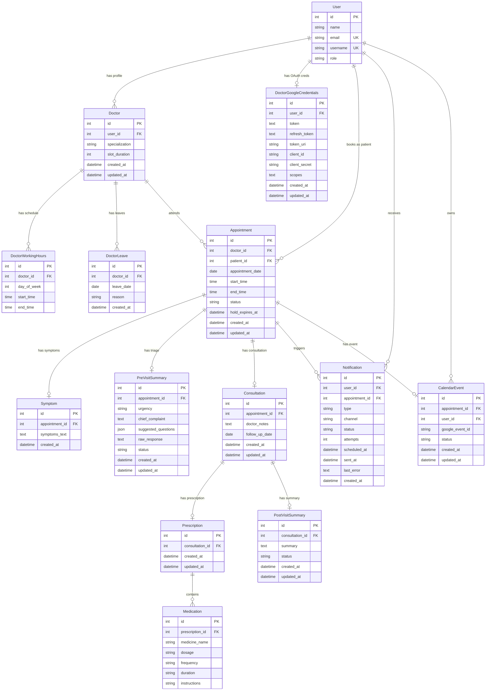

# AyuSetu — Database Schema Documentation

This document describes every table in the AyuSetu database, with relationships, constraints, indexes, design rationale, and a visual ER diagram. All fields and constraints are verified against the actual Django models.

---

## 1. Why PostgreSQL Was Chosen

PostgreSQL was selected as the production database for three specific reasons that matter to AyuSetu's design:

1. **Row-Level Locking (`SELECT FOR UPDATE`):** The booking service uses `select_for_update()` inside `transaction.atomic()` to serialize concurrent slot reservations. PostgreSQL serializes competing transactions at the row level; SQLite uses coarser file-level locking that is unreliable under concurrency.
2. **Partial Unique Indexes:** The double-booking constraint `unique_active_appointment_slot` only enforces uniqueness when `status IN ('HELD', 'CONFIRMED', 'COMPLETED')`. This is a native PostgreSQL feature — cancelled or expired appointments are excluded from the constraint so those slots can be rebooked.
3. **Full ACID Transactions:** All booking, consultation, and leave operations involve multiple related writes. PostgreSQL's transactional integrity ensures that if any step fails, the entire transaction rolls back cleanly.

---

## 2. Entity-Relationship Diagram

> Rendered natively on GitHub. All relationships are based strictly on the Django model definitions.

---

## 3. Table Reference

### Identity & Roles

#### `accounts_user` (User)
Extends Django's `AbstractUser`. Email is the login identifier (`USERNAME_FIELD = 'email'`).

| Column | Type | Constraints |
| :--- | :--- | :--- |
| `id` | `integer` | Primary Key, auto-increment |
| `name` | `varchar(255)` | Required |
| `email` | `varchar(254)` | **Unique Index** — login identifier |
| `username` | `varchar(150)` | Unique (set equal to email by `UserManager`) |
| `role` | `varchar(10)` | Choices: `PATIENT`, `DOCTOR`, `ADMIN` — default `PATIENT` |
| *(+ AbstractUser fields)* | | `password`, `is_staff`, `is_superuser`, `is_active`, `date_joined` |

---

### Doctor Availability

#### `doctors_doctor` (Doctor Profile)
One-to-one with `User`. Created by admin via the Doctor registration endpoint.

| Column | Type | Constraints |
| :--- | :--- | :--- |
| `id` | `integer` | Primary Key |
| `user_id` | `integer` | **OneToOne FK → accounts_user.id** |
| `specialization` | `varchar(255)` | |
| `slot_duration` | `integer` | Minutes per slot — default `30` |
| `created_at` | `datetime` | Auto-set on creation |
| `updated_at` | `datetime` | Auto-updated on save |

#### `doctors_doctorworkinghours` (Working Hours)
Multiple rows per doctor — one per day with configurable time windows (supports split shifts).

| Column | Type | Constraints |
| :--- | :--- | :--- |
| `id` | `integer` | Primary Key |
| `doctor_id` | `integer` | **FK → doctors_doctor.id** |
| `day_of_week` | `integer` | Choices: `0` (Mon) – `6` (Sun) |
| `start_time` | `time` | |
| `end_time` | `time` | |

#### `doctors_doctorleave` (Leave Logs)
Blocks slot generation and triggers appointment cancellation for the leave date.

| Column | Type | Constraints |
| :--- | :--- | :--- |
| `id` | `integer` | Primary Key |
| `doctor_id` | `integer` | **FK → doctors_doctor.id** |
| `leave_date` | `date` | |
| `reason` | `varchar(255)` | Optional |
| `created_at` | `datetime` | Auto-set |
| **Constraint** | | `unique_doctor_leave_date` — UNIQUE on `(doctor_id, leave_date)` |

---

### Appointment Core

#### `appointments_appointment` (Appointment Ledger)
The central table. All clinical activity links back to an appointment row.

| Column | Type | Constraints |
| :--- | :--- | :--- |
| `id` | `integer` | Primary Key |
| `doctor_id` | `integer` | **FK → doctors_doctor.id** |
| `patient_id` | `integer` | **FK → accounts_user.id** |
| `appointment_date` | `date` | |
| `start_time` | `time` | |
| `end_time` | `time` | |
| `status` | `varchar(15)` | Choices: `HELD`, `CONFIRMED`, `COMPLETED`, `CANCELLED`, `EXPIRED` — default `HELD` |
| `hold_expires_at` | `datetime` | `NULL` unless status is `HELD` |
| `created_at` | `datetime` | Auto-set |
| `updated_at` | `datetime` | Auto-updated |
| **Constraint** | | `unique_active_appointment_slot` — UNIQUE on `(doctor_id, appointment_date, start_time)` WHERE `status IN ('HELD', 'CONFIRMED', 'COMPLETED')` |

---

### Consultation & Prescription

#### `consultations_symptom` (Patient Symptoms)
Immutable record of raw patient input. One-to-one with Appointment, written on booking confirmation.

| Column | Type | Constraints |
| :--- | :--- | :--- |
| `id` | `integer` | Primary Key |
| `appointment_id` | `integer` | **OneToOne FK → appointments_appointment.id** |
| `symptoms_text` | `text` | Patient's free-form input |
| `created_at` | `datetime` | Auto-set |

#### `consultations_previsitsummary` (AI Triage)
AI-derived analysis of patient symptoms. Separate from `Symptom` to keep raw and derived data isolated.

| Column | Type | Constraints |
| :--- | :--- | :--- |
| `id` | `integer` | Primary Key |
| `appointment_id` | `integer` | **OneToOne FK → appointments_appointment.id** |
| `urgency` | `varchar(15)` | Choices: `LOW`, `MEDIUM`, `HIGH`, `UNAVAILABLE` |
| `chief_complaint` | `text` | |
| `suggested_questions` | `json` | List of exactly 3 strings |
| `raw_response` | `text` | Raw LLM response stored for debugging |
| `status` | `varchar(20)` | `PENDING`, `COMPLETED`, `FAILED` |
| `created_at` | `datetime` | Auto-set |
| `updated_at` | `datetime` | Auto-updated |

#### `consultations_consultation` (Doctor Notes)
Written by the doctor to finalize the consult. Creating this record sets `Appointment.status = COMPLETED`.

| Column | Type | Constraints |
| :--- | :--- | :--- |
| `id` | `integer` | Primary Key |
| `appointment_id` | `integer` | **OneToOne FK → appointments_appointment.id** |
| `doctor_notes` | `text` | |
| `follow_up_date` | `date` | Nullable |
| `created_at` | `datetime` | Auto-set |
| `updated_at` | `datetime` | Auto-updated |

#### `consultations_prescription` (Prescription Header)
A header record linking a consultation to its set of medications. Separated from `Consultation` to allow future multi-prescription support.

| Column | Type | Constraints |
| :--- | :--- | :--- |
| `id` | `integer` | Primary Key |
| `consultation_id` | `integer` | **OneToOne FK → consultations_consultation.id** |
| `created_at` | `datetime` | Auto-set |
| `updated_at` | `datetime` | Auto-updated |

#### `consultations_medication` (Individual Medicines)
One row per medication line. Many-to-one with Prescription.

| Column | Type | Constraints |
| :--- | :--- | :--- |
| `id` | `integer` | Primary Key |
| `prescription_id` | `integer` | **FK → consultations_prescription.id** |
| `medicine_name` | `varchar(255)` | |
| `dosage` | `varchar(255)` | e.g. `"500mg"` |
| `frequency` | `varchar(255)` | e.g. `"Twice daily"` |
| `duration` | `varchar(255)` | e.g. `"5 days"` |
| `instructions` | `varchar(255)` | Optional, e.g. `"Take after food"` |

#### `consultations_postvisitsummary` (AI Post-Visit Instructions)
Patient-friendly summary generated by OpenAI from doctor notes + medications. Links to Consultation, not Appointment directly.

| Column | Type | Constraints |
| :--- | :--- | :--- |
| `id` | `integer` | Primary Key |
| `consultation_id` | `integer` | **OneToOne FK → consultations_consultation.id** |
| `summary` | `text` | Plain-language patient instructions |
| `status` | `varchar(20)` | `PENDING`, `COMPLETED`, `FAILED` |
| `created_at` | `datetime` | Auto-set |
| `updated_at` | `datetime` | Auto-updated |

---

### Notifications & Integrations

#### `notifications_notification` (Email Queue)
Persists every notification attempt with full retry state. Decoupled from booking transactions.

| Column | Type | Constraints |
| :--- | :--- | :--- |
| `id` | `integer` | Primary Key |
| `user_id` | `integer` | **FK → accounts_user.id** — recipient |
| `appointment_id` | `integer` | **FK → appointments_appointment.id** — nullable |
| `type` | `varchar(30)` | `BOOKING_CONFIRMATION`, `APPOINTMENT_REMINDER`, `RESCHEDULE`, `CANCELLATION`, `DOCTOR_LEAVE`, `MEDICATION_REMINDER` |
| `channel` | `varchar(10)` | `EMAIL` (only channel currently implemented) |
| `status` | `varchar(15)` | `PENDING`, `PROCESSING`, `SENT`, `FAILED` |
| `attempts` | `integer` | Retry counter — max 3 before setting `FAILED` |
| `scheduled_at` | `datetime` | When the task should run |
| `sent_at` | `datetime` | Nullable — populated on success |
| `last_error` | `text` | Nullable — exception message on failure |
| `created_at` | `datetime` | Auto-set |

#### `calendar_integration_doctorgooglecredentials` (OAuth Tokens)
Stores the per-user Google OAuth tokens. One-to-one with User. **Not documented in previous version of this doc — added from actual models.**

| Column | Type | Constraints |
| :--- | :--- | :--- |
| `id` | `integer` | Primary Key |
| `user_id` | `integer` | **OneToOne FK → accounts_user.id** |
| `token` | `text` | OAuth access token |
| `refresh_token` | `text` | Nullable |
| `token_uri` | `varchar(255)` | Google token endpoint |
| `client_id` | `varchar(255)` | |
| `client_secret` | `varchar(255)` | |
| `scopes` | `text` | Space-separated scope list |
| `created_at` | `datetime` | Auto-set |
| `updated_at` | `datetime` | Auto-updated |

#### `calendar_integration_calendarevent` (Google Calendar Sync Log)

| Column | Type | Constraints |
| :--- | :--- | :--- |
| `id` | `integer` | Primary Key |
| `appointment_id` | `integer` | **OneToOne FK → appointments_appointment.id** |
| `user_id` | `integer` | **FK → accounts_user.id** |
| `google_event_id` | `varchar(255)` | Nullable — Google's event ID after creation |
| `status` | `varchar(15)` | `ACTIVE`, `DELETED`, `FAILED` |
| `created_at` | `datetime` | Auto-set |
| `updated_at` | `datetime` | Auto-updated |

---

## 4. Key Design Decisions

### Why are `Symptom` and `PreVisitSummary` separate tables instead of columns on `Appointment`?

Two different concerns are at play. `Symptom` stores the patient's **raw, immutable input** — exactly what they typed before the visit. This must never be overwritten or lost, regardless of what the AI does with it. `PreVisitSummary` stores **AI-derived output**: urgency, chief complaint, and suggested questions generated by OpenAI. These are volatile — the AI task can fail, retry, or produce different results. Separating them means:
- A failed AI task does not null out the patient's submitted symptoms.
- The doctor can always see raw symptoms even if the AI produced `status=FAILED`.
- The AI record's `status` field (`PENDING → COMPLETED / FAILED`) tracks async processing state without touching the booking record.

### Why are `Prescription` and `Medication` separate tables?

A consultation can involve **multiple medications**. A flat column on `Consultation` (e.g. a JSON blob) would make querying, editing, or reminding on individual medicines difficult. The `Prescription` header provides a clean one-to-one anchor to `Consultation`, while `Medication` rows are a proper normalized list — each can be individually addressed by the medication reminder notification system.

### Why does the `unique_active_appointment_slot` constraint only filter active statuses?

A slot that was `CANCELLED` or `EXPIRED` must be **available for rebooking**. If the unique constraint applied to all rows regardless of status, a cancelled appointment would permanently block its slot — making cancellations useless. The `WHERE status IN ('HELD', 'CONFIRMED', 'COMPLETED')` condition means the constraint is only enforced for live bookings, while historical cancelled/expired rows remain in the table for audit purposes.

### Why does `Appointment` use a `HELD` intermediate state rather than going straight to `CONFIRMED`?

The patient must submit symptoms between selecting a slot and confirming. Without a hold, two patients could simultaneously choose the same slot — one would finish the symptom form first and confirm, leaving the other with a booking collision at the final step. The 5-minute `HELD` lease with `hold_expires_at` ensures the slot is reserved for exactly one patient during the symptom-entry window, with automatic cleanup of abandoned holds.

### Why is `DoctorGoogleCredentials` stored in the database rather than a file?

Django's standard approach for OAuth tokens in multi-user systems is database storage — each user's token is isolated by `user_id`, scoped to their specific Google account. File-based credential storage (the common single-user approach) does not support multiple simultaneously authorized users in a deployed API.
